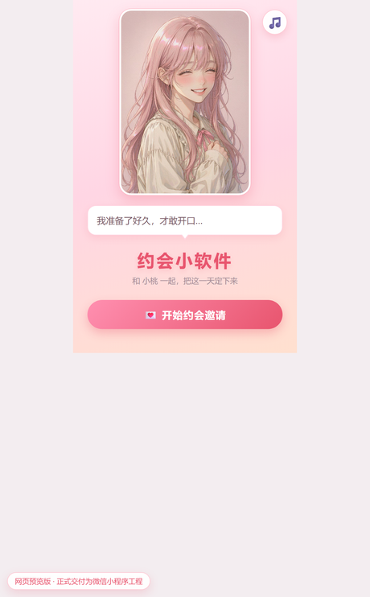
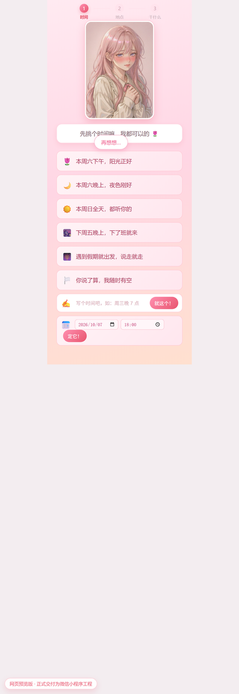
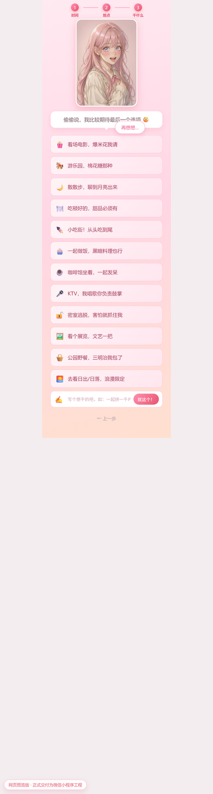
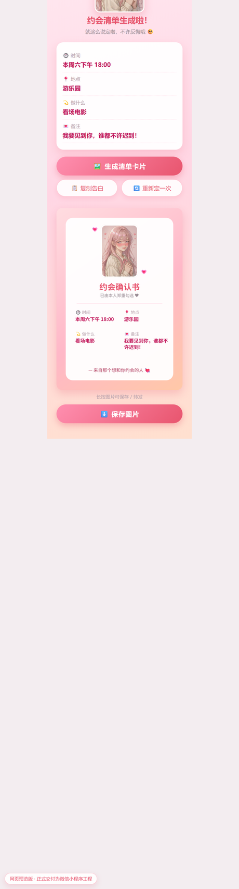
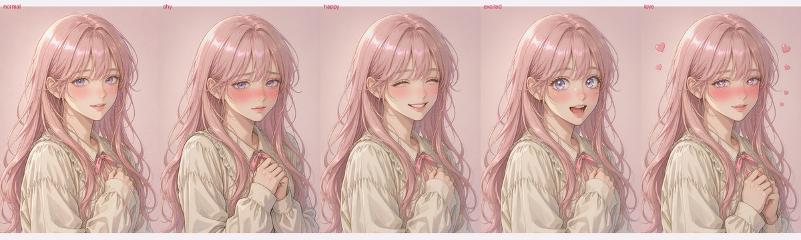
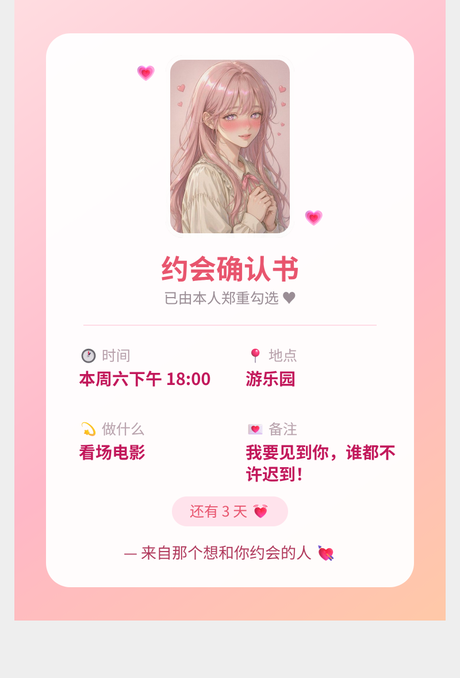

# 约会小软件 · 二次元版（微信小程序）

在原 `love_invite.html`（约会邀请单页）的基础上重做成的**微信小程序工程**，
加入了会变表情的**韩漫/条漫风格二次元少女立绘**，流程从「一次性勾选」升级成
「封面 → 三步约会设置 → 带立绘的清单卡片」的完整小软件。

角色小桃有 5 张 AI 生成的立绘，随流程自动切换：害羞 → 平常 → 激动 → 心动。
生成的约会确认书上也会印上她的立绘。

原单页 HTML 版保留在 `web/love_invite.html`，仍可直接双击打开。

---

## 效果

<p align="center">
  
  
  
  
</p>

<p align="center"><b>5 张表情立绘 · 全部由同一张基准图图生图，保证是同一个角色</b></p>



<p align="center"><b>上面生成的约会确认书（印有立绘，可直接存相册 / 转发）</b></p>

<p align="center"></p>

---

## 一、怎么跑起来

1. 打开 **微信开发者工具** → 导入项目 → 目录选 `love-date-miniprogram`
2. AppID 选「**测试号**」（工程里已填 `touristappid`，可直接跑）
3. 编译即可看到封面页

> 想立刻看效果但不想开开发者工具？直接双击 **`preview.html`**。
> 它是**单文件自包含**的（立绘已内联成 base64，419KB），双击即开、也能直接发给别人看；
> 含角色切换、完整流程、BGM、卡片生成。
> 换了 `assets/char/` 里的立绘之后，跑一次 `python tools/inline_preview_images.py` 重新内联即可。

---

## 二、目录结构

```
love-date-miniprogram/
├── app.js / app.json / app.wxss     全局配置 · 约会计划本地存储
├── project.config.json              开发者工具项目配置（appid 在此改）
├── sitemap.json
├── config/
│   └── character.js                 ★ 角色配置（立绘 / 矢量「一个开关」）
├── assets/
│   ├── char/                        ★ 5 张立绘 720×1021，共 968KB（进包体）
│   │   └── normal / shy / happy / excited / love .jpg
│   └── raw/                         1024×1536 源图（已排除，不进包也不进 git）
├── components/
│   └── anime-girl/                  ★ 二次元形象组件（立绘相框 + 矢量兜底）
│       ├── index.wxml / .wxss / .js / .json
├── pages/
│   ├── index/                       封面页（角色 + 台词 + 倒计时入口）
│   ├── invite/                      邀请流程（时间 → 地点 → 干什么）
│   └── lovecard/                    约会清单 + 生成卡片 + 保存相册 + 分享
├── utils/
│   ├── options.js                   选项库（时间/地点/活动）+ 角色台词库
│   └── music.js                     八音盒 BGM（WebAudio 现场合成）
├── docs/                            效果截图
├── tools/
│   └── inline_preview_images.py     换立绘后重跑，刷新单文件预览
└── preview.html                     网页预览版（单文件自包含，双击即开）
```

---

## 三、二次元形象怎么做的

**默认方案：AI 生成的韩漫/条漫风格立绘**（`assets/char/*.jpg`）

半写实五官、细线稿、发丝分缕、柔和渐变上色 —— 也就是那种「条漫男主女主」的质感。

一致性是重点：先出 1 张基准图（`normal`），其余 4 张全部**以基准图做图生图**，
只改表情，所以 5 张是同一个角色、同一套衣服、同一个背景和光照。

| 心情 | 触发场景 | 画面 |
|---|---|---|
| `normal` | 步骤 2 地点 | 温和微笑，正视前方 |
| `shy` | 步骤 1 时间、点「再想想」 | 重度脸红、眼神躲开、双手绞在一起 |
| `happy` | 封面 | 弯月眼 ∩、开怀大笑、头微侧 |
| `excited` | 步骤 3 干什么 | 眼睛放光、张嘴惊呼、身体前倾 |
| `love` | 生成清单 | 半眯眼、心跳脸红、双手捧胸、周围飘心 |

**呈现方式**：组件用圆角相框（白描边 + 柔和投影）承载立绘，尺寸严格按 720×1021 的比例，
`aspectFill` 不会裁到脸：

| size | 相框尺寸 | 用在哪 |
|---|---|---|
| `lg` | 440×624rpx | 封面 |
| `md` | 360×511rpx | 邀请流程 |
| `sm` | 260×369rpx | 清单页 |

调用方式（任意页面）：

```html
<anime-girl mood="shy" size="md" talking="{{true}}" />
```

**兜底方案**：组件里还留着一套纯 WXSS 手绘的矢量少女（`components/anime-girl` 的
`.stage` 部分）。把 `config/character.js` 的 `useImage` 改成 `false` 就切回去，
不依赖任何图片，体积为零。

---

## 四、想换形象？改一个文件就行

**换成你自己的立绘**（同一尺寸 720×1021，或任意比例都行，相框会自动裁）：

1. 把 5 张图放进 `assets/char/`，命名为 `normal / shy / happy / excited / love`
2. 打开 `config/character.js`，把 `images` 里的路径指向新文件

**退回矢量形象**：`useImage: false`。

两种方式都**不用改任何页面代码**——组件自己换渲染方式，表情切换逻辑照常工作。

> 换角色形象时，生成的一致性和本次一样：先定 1 张基准图，其余用图生图只改表情。

---

## 五、可选：对方选完自动微信推送给你

1. 到 <https://sct.ftqq.com> 微信扫码，免费领一个 `SendKey`
2. 填进 `app.js` 的 `globalData.notifyKey`
3. 到小程序后台「开发管理 → 开发设置 → 服务器域名 → request 合法域名」
   添加 `https://sctapi.ftqq.com`

不填则自动跳过，不影响任何功能。

---

## 六、相比原版新增了什么

| 能力 | 原版 love_invite.html | 现在 |
|---|---|---|
| 二次元形象 | 无（只有 emoji） | AI 生成的韩漫风立绘，5 种表情随流程自动切换 |
| 步骤引导 | 无 | 时间 → 地点 → 干什么 三步指示器 |
| 精确日期 | 只能选「本周六下午」这种文字 | 额外支持日期 + 时间选择器，可算倒计时 |
| 倒计时 | 无 | 封面与清单页自动显示「还有 N 天」 |
| 清单卡片 | canvas 长按保存 | canvas 生成、**印上立绘**、一键保存到相册（含权限引导） |
| 分享 | 无 | 微信分享给好友 / 朋友圈 |
| 拒绝按钮 | 鼠标躲闪 | 手机端「点到就跑 + 越点越小 + 换台词」 |
| 背景音乐 | Web Audio 八音盒 | 同款移植，右上角一键静音 |
| 数据持久化 | 无 | 约会计划存本地，下次打开还在 |
